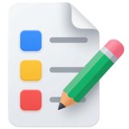

# Introduction

**Project Notes** is a powerful notes management and project metrics aggregator designed for project managers who manage multiple project teams on a regular basis. The aggregator provides an overall health check of active projects. It helps to track stakeholders and manage communication with them. For project meetings, Project Notes organizes notes and items by project.

The integrated Python script language makes Project Notes easy to customize. Using Python, Project Notes can be integrated with many different enterprise applications and external data sources.

Project managers spend much of their time accounting, tracking and reporting tasks. By automating as much of these tasks, project managers can free up more time for project communication and team leadership. The Project Notes platform is designed to help project managers automate many regular tasks.

* Meeting Notes & Action Items
* Emailing Standard Communication
* Tracking Issues
* Track Change Requests
* Tracking Associated Files & Folders
* Sending Meeting Notes
* Sending Tracker Items Status Reminders
* Creating Status Reports
* Scheduling Meetings
* Cloud Backup & Multi-Device Sync (Project Notes Pro subscription)
* Accessing Information on the Go with Project Notes Mobile